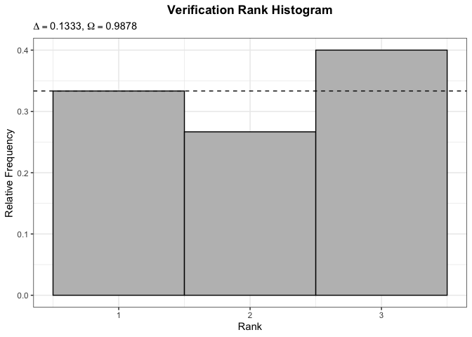
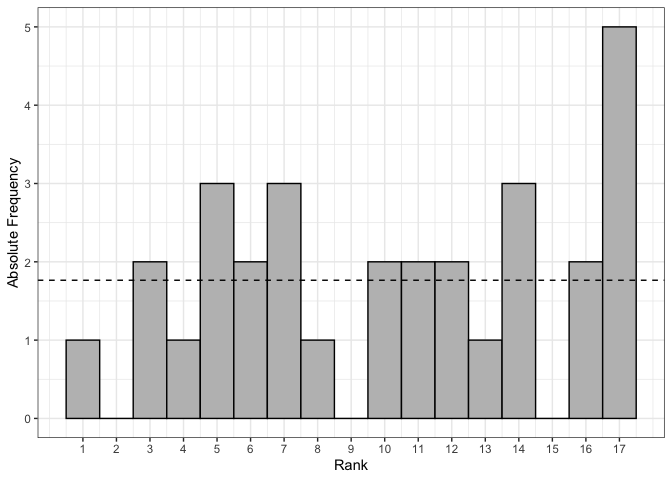

# eppverification: Verification Tools for the Statistical Postprocessing of Ensemble Forecasts 

<!-- badges: start -->

[](https://CRAN.R-project.org/package=eppverification)
[](https://github.com/jobstdavid/eppverification/actions)
[](https://codecov.io/gh/jobstdavid/eppverification)
[](https://github.com/jobstdavid/eppverification)
[](https://doi.org/10.5281/zenodo.5574572)
<!-- badges: end -->

An R package providing user-friendly **univariate and multivariate
verification** tools for the statistical ensemble post-processing. It
allows to score and assess the **calibration (reliability)** and
**sharpness** of ensemble forecasts and predictive distributions. In
addition this package can be used to create **useful contemporary
visualizations** for verification.

## Installation

You can install the latest development version from
[GitHub](https://github.com/jobstdavid) with:

``` r
#install.packages("remotes")
remotes::install_github("jobstdavid/eppverification")
```

## Package overview

The goal of probabilistic forecasting is to maximize the **sharpness**
of the probabilistic forecast *F* (CDF) subject to **calibration**.
Therefore this package contains tools for assessing:

-   **calibration (reliability)**. It refers to the statistical
    consistency between the predictive probabilistic forecast *F* and
    the associated observation *y*. Consequently it is a joint property
    of predictions and verifications. The predictive probabilistic
    forecast *F* is calibrated, if the observation *y* can not be
    distinguished from a random draw from the predictive probabilistic
    forecast *F*.
-   **sharpness**. It refers to the dispersion (spread) of the
    predictive probabilistic forecast *F*. Additionally it is a property
    of the predictive probabilistic forecast *F*, only. The more
    concentrated/narrower the predictive probabilistic forecast *F* is,
    the sharper the forecast is.
-   **calibration and sharpness simultaneously**. Proper scoring rules
    assess calibration and sharpness properties of the predictive
    probabilistic forecast *F* simultaneously. They are functions of the
    predictive probabilistic forecast *F* and the associated observation
    *y*. A smaller score of a proper scoring rule indicates a “better”
    forecast.

In the following you find univariate and multivariate verification tools
for calibration, sharpness and proper scoring rules, where the
corresponding function provided within this package is written in
brackets.

### Univariate Verification Tools

-   **Calibration**: Verification Rank Histogram (`vr.hist`),
    Reliability Index (`ri`), Entropy (`ent`), PIT Histogram
    (`pit.hist`), Central Prediction Interval Coverage (`cpi`).
-   **Sharpness**: Root Mean Variance (`rmv`), Variance of PIT-Values
    (`var.pit`), Central Prediction Interval Width (`cpi`).
-   **Proper Scoring Rules**: Continuous Ranked Probability Score
    (`crps`), Logarithmic Score (`logs`), Interval Score (`is`),
    Quantile Score (`qs`), Brier Score (`bs`), Dawid-Sebastiani Score
    (`dss`), Absolute Error (`ae`), Squared Error (`se`).

### Multivariate Verification Tools

-   **Calibration**: Multivariate Verification Rank Histogram
    (`mvr.hist`), Multivariate Reliability Index (`mri`), Multivariate
    Entropy (`ment`).
-   **Sharpness**: Determinant Sharpness (`ds`).
-   **Proper Scoring Rules**: Energy Score (`es`), Euclidean Error
    (`ee`), Variogram Score (`vs`).

Further functions for **model comparison and visualizations** in this
package are:

-   `dm.test`: This function performs a Diebold-Mariano-Test for two
    forecasts.
-   `cpi.plot`: This function plots the central prediction intervals for
    a certain interval range.
-   `cov.plot`: This function plots the central prediction interval
    coverage for certain interval ranges of different models.
-   `line.plot`: This function creates line plots.
-   `score.plot`: This function plots scores of different models rated
    by selected measures as heatmap.
-   `map.plot`: This function creates map plots for given coordinates.
-   `box.plot`: This function creates box plots.

## Examples

``` r
#load R package
library(eppverification)

#set.seed for reproducibility 
set.seed(2021)
```

### Univariate Verification Tools

#### Calibration

``` r
#simulated data
n <- 30
m <- 50
y <- rnorm(n)
x <- matrix(rnorm(n*m), ncol = m)

#Verification Rank Histogram
vr.hist(y = y, x = x, bins = 3, ri = TRUE, ent = TRUE)
```



``` r
#simulated data
n <- 10000
u <- runif(n)

#PIT Histogram
pit.hist(u = u, bins = 5, var = TRUE, m = TRUE)
```


#### Sharpness

``` r
#Root Mean Variance
rmv(x = x)
#> [1] 1.024492
```

#### Proper Scoring Rules

``` r
#simulated data
n <- 30
m <- 10000
y <- rnorm(n)
x <- matrix(rnorm(n*m), ncol = m)

#Continuous Ranked Probability Score
crps(y = y, x = x, method = "mc", mean = FALSE)
#>  [1] 0.4290064 0.2755435 0.2501220 0.6178993 0.3712576 0.2832387 0.7206051
#>  [8] 0.2422346 1.5479873 0.6552556 0.2346909 1.1957392 0.4732738 0.4448955
#> [15] 0.3048436 0.6970912 0.3832150 0.7664726 0.7192077 0.2581383 0.5115454
#> [22] 0.3270349 0.8321649 2.0065355 0.7828538 0.6345589 0.4778476 0.2375604
#> [29] 0.3476215 0.2369981
```

``` r
#simulated data
n <- 30
y <- rnorm(n, mean = 1:n)
interval.range <- 90
alpha <- (100-interval.range)/100
lower <- qnorm(alpha/2, rnorm(n, mean = 1:n))
upper <- qnorm((1-alpha/2), rnorm(n, mean = 1:n))

#Central Prediction Interval Values
cpi(y = y, lower = lower, upper = upper, interval.range = interval.range,
separate = c("is", "overprediction", "underprediction", "width", "coverage"), mean = TRUE)
#> $is
#> [1] 4.731572
#> 
#> $overprediction
#> [1] 0.6513018
#> 
#> $underprediction
#> [1] 0.9931737
#> 
#> $width
#> [1] 3.087097
#> 
#> $coverage
#> [1] 0.7666667
```

### Multivariate Verification Tools

#### Calibration

``` r
#simulated data
n <- 30
m <- 50
y <- cbind(rnorm(n), rgamma(n, shape = 1))
x <- array(NA, dim = c(m, 2, n))
x[, 1, ] <- rnorm(n*m)
x[, 2, ] <- rgamma(n*m, shape = 1)

#Multivariate Verification Rank Histogram
mvr.hist(y = y, x = x, method = "mv", type = "absolute", bins = 17)
```



#### Sharpness

``` r
#simulated data
n <- 30
m <- 50
x <- array(NA, dim = c(2, 2, n))
for (i in 1:n) {
x[, , i] <- cov(cbind(rnorm(m), rgamma(m, shape = 1)))
}

#Determinant Sharpness
ds(x = x, mean = TRUE)
#> [1] 0.9767044
```

#### Proper Scoring Rules

``` r
#simulated data
n <- 30
m <- 50
y <- cbind(rnorm(n), rgamma(n, shape = 1))
x <- array(NA, dim = c(m, 2, n))
x[, 1, ] <- rnorm(n*m)
x[, 2, ] <- rgamma(n*m, shape = 1)

#Energy Score
es(y = y, x = x, method = "ens", mean = FALSE)
#>  [1] 1.5085358 0.4271176 0.5437876 0.5381457 0.3655731 0.4727486 0.3593574
#>  [8] 0.6184233 0.4597113 1.5109192 0.5635740 1.2293665 3.2258953 0.5847054
#> [15] 1.2106759 0.7710612 0.7012249 1.0368169 1.8140216 0.9094851 0.5705275
#> [22] 0.4817557 0.3294422 0.7319828 0.5059306 0.6867467 1.6762057 0.8481168
#> [29] 0.4483804 0.8020821

#Euclidean Error
ee(y = y, x = x, method = "median", mean = FALSE)
#>  [1] 2.0594456 0.5675969 0.7733583 0.7483802 0.2913774 0.6934381 0.3796483
#>  [8] 0.9239989 0.5867087 2.0868004 0.8168255 1.8245880 4.0522907 0.9217518
#> [15] 1.8073039 1.1369489 0.9747105 1.4742496 2.4782082 1.3172426 0.8215319
#> [22] 0.6881254 0.2794533 1.1538583 0.5470560 0.9375704 2.3018176 1.2545919
#> [29] 0.4307491 1.1370068
```

### Model Comparison and Visualizations

``` r
#simulated data
n <- 365
s1 <- arima.sim(list(ar = 0.7), sd = 0.5, 100)
s2 <- arima.sim(list(ar = 0.7), sd = 0.5, 100) - 0.2

#Diebold-Mariano-Test
dm.test(s1, s2, alternative = "two.sided", h = 1)
#> 
#>  Diebold-Mariano Test
#> 
#> data:  s1 s2
#> DM = 2.5055, Forecast Horizon = 1, p-value = 0.01223
#> alternative hypothesis: two.sided
```

``` r
#simulated data
n <- 30
x <- seq(Sys.Date(), by = "day", length.out = n)
y <- rnorm(n, mean = 1:n)
interval.range <- 90
alpha <- (100-interval.range)/100
lower <- qnorm(alpha/2, rnorm(n, mean = 1:n))
upper <- qnorm((1-alpha/2), rnorm(n, mean = 1:n))

#Central Prediction Intervals Plot
cpi.plot(x = x, y = y, lower = lower, upper = upper, interval.range = interval.range, x.lab = "Date", y.lab = "Value", info = TRUE)
```


``` r
#simulated data
n <- 30
x <- matrix(runif(n)*100, ncol = 3)
x <- apply(x, 2, sort)
interval.range <- seq(5, 95, length.out = 10)
models <- c("A", "B", "C")

#Central Prediction Interval Coverage Model Comparison
cov.plot(x = x, models = models, interval.range = interval.range)
```


``` r
#simulated data
n <- 30
k <- 10
x <- seq(Sys.Date(), by = "day", length.out = n)
obs <- rnorm(n, mean = 1:n)
y <- sapply(1:k, function(i) obs-(i-1)*runif(n))
names <- c("observation", paste("forecast", sep = " ", 1:(k-3)), "modified forecast 1", "modified forecast 2")
linetypes <- c("solid", rep("solid", k-3), "dashed", "dotted")
colors <- c("red", rep("black", k-3), rep("steelblue", 2))

#Line Plot
line.plot(x = x, y = y, names = names, linetypes = linetypes, colors = colors, x.lab = "Date", y.lab = "Value", legend = "bottom")
```


``` r
#simulated data
x <- matrix(c(0.5, 0.3, 0.8, 0.21, 1.5, 0.7, 2, 1), byrow = TRUE, ncol = 4)
models <- c("A", "B", "C", "D")
measures <- c("CRPS", "LogS")

#Score Plot
score.plot(x = x, models = models, measures = measures)
```


``` r
#simulated data
coordinates <- c(13.38, 52.53, 16.36, 48.21, 19.04, 47.50, 21.02, 52.24, 2.35, 48.86, -0.13, 51.51, -3.70, 40.42, 12.50, 41.90, -9.14, 38.74)
coordinates <- matrix(coordinates, ncol = 2, byrow = TRUE)
names <- c("A", "A", "B", "A", "B", "A", "A", "B", "A")
size <- rep(5, 9)
shape <- c(16, 16, 17, 16, 17, 16, 16, 17, 16)
colors <- c("red", "red", "steelblue", "red", "steelblue", "red", "red", "steelblue", "red")

#Map Plot
map.plot(coordinates = coordinates, names = names, maptype = "terrain-background", size = size, shape = shape, colors = colors)
```


``` r
#simulated data
n <- 30
x <- cbind(rnorm(n), rgamma(n, shape = 1))
names <- c("A", "B")

#Box Plot
box.plot(x = x, names = names, x.lab = "Models", y.lab = "Values")
```


## Contact

Feel free to contact <jobst@imai.uni-hildesheim.de> if you have any
questions or suggestions.

## References

Gneiting, T. and Raftery, A. (2007). Strictly Proper Scoring Rules,
Prediction, and Estimation. Journal of the American Statistical
Association. 102(477). 359-378.
