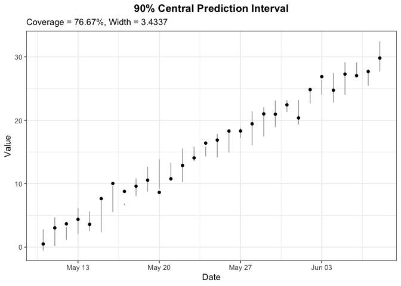
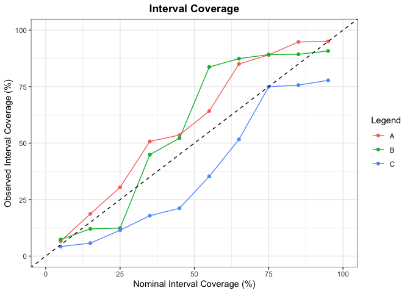

# eppverification: Verification Tools for the Statistical Postprocessing of Ensemble Forecasts 

<!-- badges: start -->

[](https://CRAN.R-project.org/package=eppverification)
[](https://github.com/jobstdavid/eppverification/actions/workflows/R-CMD-check.yaml)
[](https://codecov.io/gh/jobstdavid/eppverification)
[](https://github.com/jobstdavid/eppverification)
[](https://doi.org/10.5281/zenodo.5574572)
<!-- badges: end -->

An R package providing user-friendly **univariate and multivariate
verification** tools for the statistical ensemble post-processing. It
allows to score and assess the **calibration (reliability)** and
**sharpness** of ensemble forecasts and predictive distributions. In
addition this package can be used to create **useful contemporary
visualizations** for verification.

## Installation

You can install the latest development version from
[GitHub](https://github.com/jobstdavid) with:

``` r
#install.packages("remotes")
remotes::install_github("jobstdavid/eppverification")
```

## Package overview

The goal of probabilistic forecasting is to maximize the **sharpness**
of the probabilistic forecast *F* (CDF) subject to **calibration**.
Therefore this package contains tools for assessing:

- **calibration**. It refers to the statistical consistency between the
  predictive probabilistic forecast *F* and the associated observation
  *y*. Consequently it is a joint property of predictions and
  verifications. The predictive probabilistic forecast *F* is
  calibrated, if the observation *y* can not be distinguished from a
  random draw from the predictive probabilistic forecast *F*.
- **sharpness**. It refers to the spread of the predictive probabilistic
  forecast *F*. Additionally it is a property of the predictive
  probabilistic forecast *F*, only. The more concentrated/narrower the
  predictive probabilistic forecast *F* is, the sharper the forecast is.
- **calibration and sharpness simultaneously**. Proper scoring rules
  assess calibration and sharpness properties of the predictive
  probabilistic forecast *F* simultaneously. They are functions of the
  predictive probabilistic forecast *F* and the associated observation
  *y*. A smaller score of a proper scoring rule indicates a “better”
  forecast.

In the following you find univariate and multivariate verification tools
for calibration, sharpness and proper scoring rules, where the
corresponding function provided within this package is written in
brackets.

### Univariate Verification Tools

- **Calibration**: Verification Rank Histogram (`vr.hist`), Reliability
  Index (`ri`), Entropy (`ent`), PIT Histogram (`pit.hist`), Central
  Prediction Interval Coverage (`cpi`).
- **Sharpness**: Root Mean Variance (`rmv`), Central Prediction Interval
  Width (`cpi`).
- **Dispersion**: Variance of PIT-Values (`var.pit`).
- **Proper Scoring Rules**: Continuous Ranked Probability Score
  (`crps`), Logarithmic Score (`logs`), Interval Score (`is`), Quantile
  Score (`qs`), Brier Score (`bs`), Dawid-Sebastiani Score (`dss`),
  Absolute Error (`ae`), Squared Error (`se`).

### Multivariate Verification Tools

- **Calibration**: Multivariate Verification Rank Histogram
  (`mvr.hist`), Multivariate Reliability Index (`mri`), Multivariate
  Entropy (`ment`).
- **Sharpness**: Determinant Sharpness (`ds`).
- **Proper Scoring Rules**: Energy Score (`es`), Euclidean Error (`ee`),
  Variogram Score (`vs`).

Further functions for **model comparison and visualizations** in this
package are:

- `dm.test`: This function performs a Diebold-Mariano-Test for two
  forecasts.
- `bh.test`: This function performs a Benjamini-Hochberg-Correction for
  different p-values.
- `ss`: This function calculates the skill score.
- `cpi.plot`: This function plots the central prediction intervals for a
  certain interval range.
- `cov.plot`: This function plots the central prediction interval
  coverage for certain interval ranges of different models.
- `line.plot`: This function creates line plots.
- `score.plot`: This function plots scores of different models rated by
  selected measures as heatmap.

## Examples

``` r
#load R package
library(eppverification)

#set.seed for reproducibility 
set.seed(2023)
```

### Univariate Verification Tools

#### Calibration

``` r
#simulated data
n <- 30
m <- 50
y <- rnorm(n)
x <- matrix(rnorm(n*m), ncol = m)

#Verification Rank Histogram
vr.hist(y = y, x = x, bins = 3, ri = TRUE, ent = TRUE)
```


``` r
#simulated data
n <- 10000
u <- runif(n)

#PIT Histogram
pit.hist(u = u, bins = 5, v = TRUE, m = TRUE)
```


#### Sharpness

``` r
#Root Mean Variance
rmv(x = x)
#> [1] 1.000718
```

#### Proper Scoring Rules

``` r
#simulated data
n <- 30
m <- 50
y <- rnorm(n)
x <- matrix(rnorm(n*m), ncol = m)

#Continuous Ranked Probability Score
crps(y = y, x = x, method = "ens", mean = FALSE)
#>  [1] 0.4044568 0.4476677 0.6309580 0.3112616 0.3108355 0.4333361 0.3785663
#>  [8] 0.2708835 1.5276564 0.2908729 0.2576431 0.5222287 0.5150330 0.2260173
#> [15] 0.2063663 0.3793887 0.3628304 0.2881931 0.2216882 0.5365261 0.2261479
#> [22] 0.3454574 0.8881519 0.3738404 0.2607649 2.1705713 0.3876263 0.3470455
#> [29] 0.6136417 1.2510219
```

``` r
#simulated data
n <- 30
y <- rnorm(n, mean = 1:n)
interval.range <- 90
alpha <- (100-interval.range)/100
lower <- qnorm(alpha/2, rnorm(n, mean = 1:n))
upper <- qnorm((1-alpha/2), rnorm(n, mean = 1:n))

#Central Prediction Interval Values
cpi(y = y, lower = lower, upper = upper, interval.range = interval.range,
separate = c("is", "overprediction", "underprediction", "width", "coverage"), mean = TRUE)
#> $is
#> [1] 7.615486
#> 
#> $overprediction
#> [1] 1.813372
#> 
#> $underprediction
#> [1] 2.248097
#> 
#> $width
#> [1] 3.554018
#> 
#> $coverage
#> [1] 0.7666667
```

### Multivariate Verification Tools

#### Calibration

``` r
#simulated data
n <- 30
m <- 50
y <- cbind(rnorm(n), rgamma(n, shape = 1))
x <- array(NA, dim = c(m, 2, n))
x[, 1, ] <- rnorm(n*m)
x[, 2, ] <- rgamma(n*m, shape = 1)

#Multivariate Verification Rank Histogram
mvr.hist(y = y, x = x, method = "mv", type = "absolute", bins = 17)
```


#### Sharpness

``` r
#simulated data
n <- 30
m <- 50
x <- array(NA, dim = c(2, 2, n))
for (i in 1:n) {
x[, , i] <- cov(cbind(rnorm(m), rgamma(m, shape = 1)))
}

#Determinant Sharpness
ds(x = x, covmat = TRUE, mean = TRUE)
#> [1] 0.9970074
```

#### Proper Scoring Rules

``` r
#simulated data
n <- 30
m <- 50
y <- cbind(rnorm(n), rgamma(n, shape = 1))
x <- array(NA, dim = c(m, 2, n))
x[, 1, ] <- rnorm(n*m)
x[, 2, ] <- rgamma(n*m, shape = 1)

#Energy Score
es(y = y, x = x, method = "ens", mean = FALSE)
#>  [1] 0.3679223 0.6521718 0.5867337 1.3207527 0.5923960 0.8014708 0.6155624
#>  [8] 0.5966585 0.4954663 0.5689130 1.0170484 0.9257865 0.7126627 1.0177198
#> [15] 0.4446926 0.5793670 0.8292774 0.3894942 0.7610561 1.0147788 0.6482789
#> [22] 0.6016987 0.9588860 0.7525639 0.5009687 0.3757042 0.4942515 1.0843650
#> [29] 0.5392592 0.5930677

#Euclidean Error
ee(y = y, x = x, method = "median", mean = FALSE)
#>  [1] 0.3843640 1.0082464 0.7714796 1.8920704 0.7815929 1.0710445 0.8744638
#>  [8] 0.7835254 0.5884070 0.8685138 1.4978914 1.3088488 1.0180394 1.4127809
#> [15] 0.3788144 0.7746369 1.3653489 0.4873720 1.1309196 1.5534546 1.0120617
#> [22] 0.8120946 1.6097738 1.2245092 0.7507934 0.4449919 0.7341716 1.6176761
#> [29] 0.5673728 0.9157790
```

### Model Comparison and Visualizations

``` r
#simulated data
n <- 365
s1 <- arima.sim(list(ar = 0.7), sd = 0.5, 100)
s2 <- arima.sim(list(ar = 0.7), sd = 0.5, 100) - 0.2
p <- runif(100, min = 0, max = 0.05)

#Diebold-Mariano-Test
dm.test(s1, s2, alternative = "two.sided", h = 1)
#> 
#>  Diebold-Mariano Test
#> 
#> data:  s1 s2
#> DM = 2.3689, Forecast Horizon = 1, p-value = 0.01978
#> alternative hypothesis: two.sided

#Benjamini-Hochberg-Procedure
bh.test(p, alpha = 0.05)
#>   [1] TRUE TRUE TRUE TRUE TRUE TRUE TRUE TRUE TRUE TRUE TRUE TRUE TRUE TRUE TRUE
#>  [16] TRUE TRUE TRUE TRUE TRUE TRUE TRUE TRUE TRUE TRUE TRUE TRUE TRUE TRUE TRUE
#>  [31] TRUE TRUE TRUE TRUE TRUE TRUE TRUE TRUE TRUE TRUE TRUE TRUE TRUE TRUE TRUE
#>  [46] TRUE TRUE TRUE TRUE TRUE TRUE TRUE TRUE TRUE TRUE TRUE TRUE TRUE TRUE TRUE
#>  [61] TRUE TRUE TRUE TRUE TRUE TRUE TRUE TRUE TRUE TRUE TRUE TRUE TRUE TRUE TRUE
#>  [76] TRUE TRUE TRUE TRUE TRUE TRUE TRUE TRUE TRUE TRUE TRUE TRUE TRUE TRUE TRUE
#>  [91] TRUE TRUE TRUE TRUE TRUE TRUE TRUE TRUE TRUE TRUE
```

``` r
#simulated data
n <- 30
x <- seq(Sys.Date(), by = "day", length.out = n)
y <- rnorm(n, mean = 1:n)
interval.range <- 90
alpha <- (100-interval.range)/100
lower <- qnorm(alpha/2, rnorm(n, mean = 1:n))
upper <- qnorm((1-alpha/2), rnorm(n, mean = 1:n))

#Central Prediction Intervals Plot
cpi.plot(x = x, y = y, lower = lower, upper = upper, interval.range = interval.range, x.lab = "Date", y.lab = "Value", info = TRUE)
```



``` r
#simulated data
n <- 30
x <- matrix(runif(n)*100, ncol = 3)
x <- apply(x, 2, sort)
interval.range <- seq(5, 95, length.out = 10)
models <- c("A", "B", "C")

#Central Prediction Interval Coverage Model Comparison
cov.plot(x = x, models = models, interval.range = interval.range)
```



``` r
#simulated data
n <- 30
k <- 10
x <- seq(Sys.Date(), by = "day", length.out = n)
obs <- rnorm(n, mean = 1:n)
y <- sapply(1:k, function(i) obs-(i-1)*runif(n))
names <- c("observation", paste("forecast", sep = " ", 1:(k-3)), "modified forecast 1", "modified forecast 2")
linetypes <- c("solid", rep("solid", k-3), "dashed", "dotted")
colors <- c("red", rep("black", k-3), rep("steelblue", 2))

#Line Plot
line.plot(x = x, y = y, names = names, linetypes = linetypes, colors = colors, x.lab = "Date", y.lab = "Value", legend = "bottom")
```


``` r
#simulated data
x <- matrix(c(0.5, 0.3, 0.8, 0.21, 1.5, 0.7, 2, 1), byrow = TRUE, ncol = 4)
models <- c("A", "B", "C", "D")
measures <- c("CRPS", "LogS")

#Score Plot
score.plot(x = x, models = models, measures = measures)
```


## Contact

Feel free to contact <jobstd@uni-hildesheim.de> if you have any
questions or suggestions.

## References

Gneiting, T. and Raftery, A. (2007). Strictly Proper Scoring Rules,
Prediction, and Estimation. Journal of the American Statistical
Association. 102(477). 359-378.
